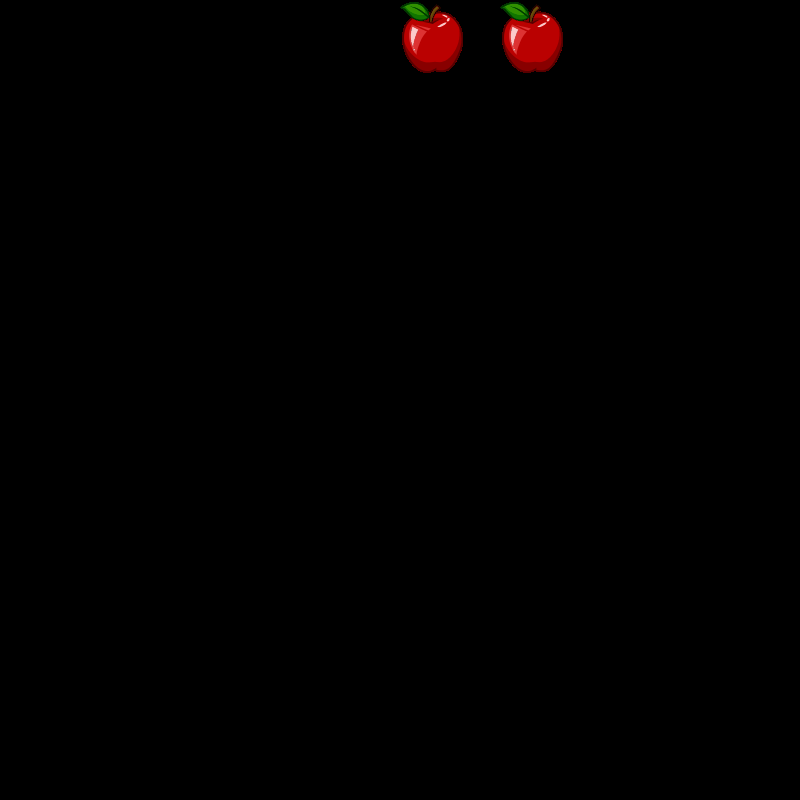
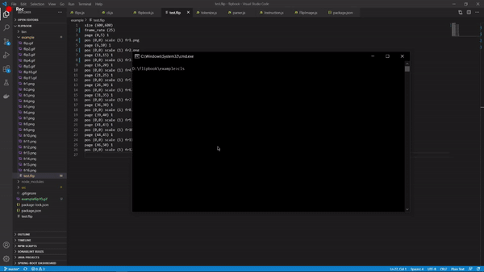

# Flipbook Compiler
Compiler for flipbook language written in javascript

## npm packages
[gif-encoder-2](https://www.npmjs.com/package/gif-encoder-2/)   
[canvas](https://www.npmjs.com/package/canvas/)   

## setup   
clone the package    
Run `cd flipbook`   
Run `npm link`      
`flipc` compiler will be installed

## Running the `flip` file    
Run `flipc test.flip -o output.gif`   
`test.flip` is the flip file that we want to run
`output.gif` is the final gif that will be created in the same directory. 
 

## syntax for `flip` language
`page (left,right) n`   
`pos (x1,y1) scale(z1) image_file_name_1`   
`pos (x2,y2) scale(z2) image_file_name_2`   
.    
.   
`pos (xn,yn) scale(zn) image_file_name_n`   

## keywords

`page (left,right) n` = range of frames for displaying the given 'n' number of images.    
`pos (x,y)` = pos denotes position of image in the frame. x and y integer coordinates of top left corner of image   
`scale(z)` = amount by which the image has to be scaled. z is a positive floating number    
`image_file_name` = file name of the image    
 
 ## Optional Parameters
 `size (x,y)` = For specifying the dimensions of gif file. x and y are positive integers. Default `800x800`     
 `frame_rate (z)` = For specifying the framerate of gif. default 30 frames per second.  
  These have to be specified at the top of flip file     
  ## sample `flip` file
    There is a sample flip file in the `example` folder and the images required to run the file are also given.
    
    

## multiple image gif
    
For running apple.flip    
`cd example`  
`flipc apple.flip -o output.gif`   

## demo gif   
    
   

For running test.flip    
`cd example`  
`flipc test.flip -o output.gif`   

